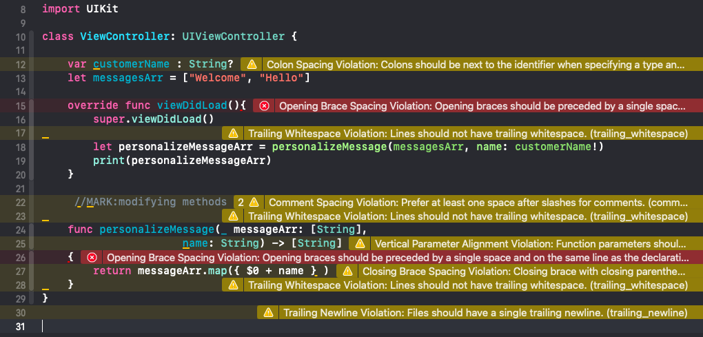

# Code-style-guide-rules-
Set the code style rules for the whole team to use, using `SwiftLint`.

## Using:
**SwiftLint**: https://github.com/realm/SwiftLint

## Steps:
**1.** Install the library: 
> I used **Cocoa Pods**, for other options check the link above.
```
pod 'SwiftLint'
```


**2.** Add the script: 
* Select the project -> Target -> Build Phases
* Click on (+) button -> New Run Script Phase
* Add the following text:
> Note that script is different based on the way of installation, check the link above.
```
"${PODS_ROOT}/SwiftLint/swiftlint"
```


**3.** Set specific rules, this step is optional if satisfied with dafualt rules.
* In terminal, change to directory, then create `.swiftLint.yml` file.
* A sample `.swiftlint.yml` file would look like below:
> For a whole list of rules check the link https://realm.github.io/SwiftLint/rule-directory.html
```
disabled_rules:
  - identifier_name
  - force_cast
    
opt_in_rules:
  - closing_brace
  
excluded:
  - Carthage
  - Pods
  
file_length:
  warning: 500
  error: 900

opening_brace:
    severity: error
```


**4.** Build the project to check the warnings and errors.



